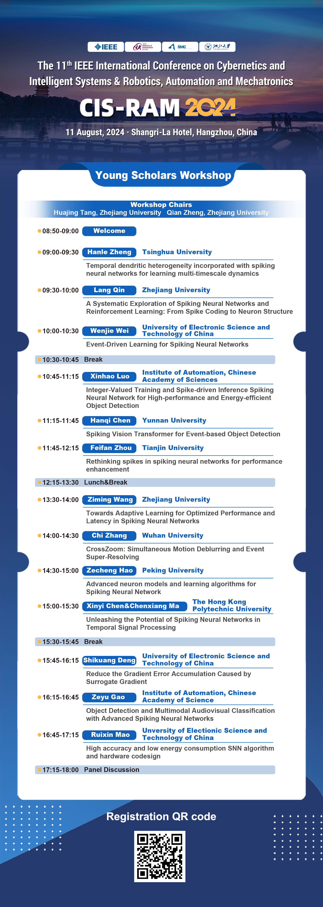

## Biography
Hello👋! This is Wenjie Wei🙎‍♀️. I am currently pursuing🏃‍♀️ a Ph.D. in [the University of Electronic Science and Technology of China](https://en.uestc.edu.cn/)🏫, under the supervision of Prof. [Malu Zhang](https://sites.google.com/view/malu-zhang/home)🧑‍🏫. Prior to this, I obtained my Bachelor’s degree👩‍🎓 from [Zhengzhou University](http://international.zzu.edu.cn/)🏫 in 2021. My research interests broadly include 🧠neuromorphic computing💻 and 🤏efficient deep learning🤖.

## Research Interests
- 📘 Neuromorphic Computing: Spiking Neural Networks, Brain-inspired Neural Architecture Design, etc.
- 📘 Efficient Deep Learning: Network Binarization, Quantization, Pruning, etc.

## Publications
- Temporal-coded spiking neural networks with dynamic firing threshold: Learning with event-driven backpropagation. ICCV 2023. [paper](https://openaccess.thecvf.com/content/ICCV2023/papers/Wei_Temporal-Coded_Spiking_Neural_Networks_with_Dynamic_Firing_Threshold_Learning_with_ICCV_2023_paper.pdf) Wenjie Wei, Malu Zhang*, Hong Qu, Ammar Belatreche, Jian Zhang, Hong Chen

## Academic Services
- Reviewer for conferences and journals, including ICLR2025, Neural Networks, IEEE TETCI, etc.
- Invited speaker at the IEEE CIS-RAM 2024 Young Scholars Workshop on "*Event-Driven Learning for Spiking Neural Networks*". [Poster](#image)

    

